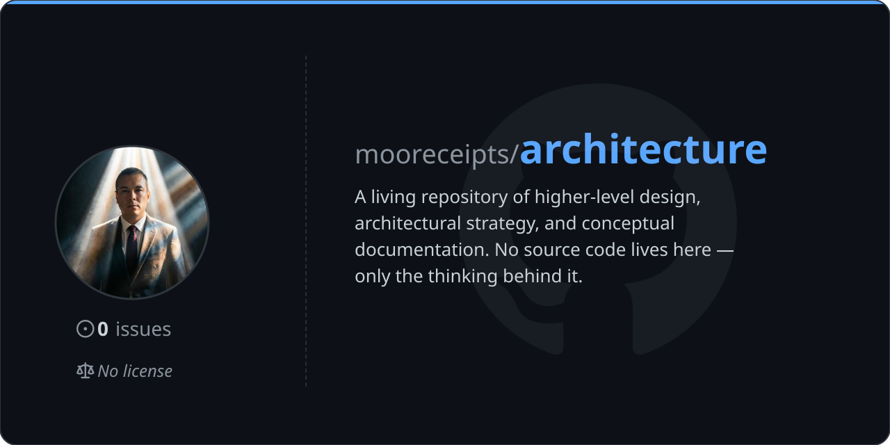

[](https://github.com/mooreceipts/architecture)

---

# architecture

A living repository of higher-level design, architectural strategy, and conceptual documentation. No source code lives here — only the thinking behind it.

Documents are written to capture **intent and reasoning**. They are meant to be referenced, revised, and built upon as systems evolve. Nothing here is considered finalized.

---

## Structure

```
architecture/
├── harness engineering/
│   ├── operators-guide.md                        # Workflow shifts after harness adoption
│   ├── pi-harness-hardening-plan.md              # Hardening strategy: fitness checks, token control, mechanical bounds
│   └── why-configure-your-harness.md             # Rationale for harness configuration
└── pi/
    ├── persistent portable memory strategy/
    │   ├── pi-persistent-portable-memory-strategy.md          # Dual-tier memory architecture, vault sync
    │   ├── pi-persistent-portable-memory-strategy.excalidraw  # System topology (source)
    │   └── pi-persistent-portable-memory-strategy.png         # Rendered diagram
    └── subagent delegation implementation/
        ├── pi-delegation-strategy.md              # Delegation pipeline, routing, subprocess isolation
        ├── pi-delegation-strategy.excalidraw      # Architecture diagram (source)
        └── pi-delegation-strategy.png             # Rendered diagram
```

---

## Conventions

- **Markdown** for all written documents
- **Excalidraw** for diagrams, with a rendered PNG alongside each source file
- Folder names reflect the subject domain, not the document type
- Written for a technical audience familiar with the system being described

---

## Status

Living document set. Content is added and revised continuously. No version guarantees — check commit history for change context.
