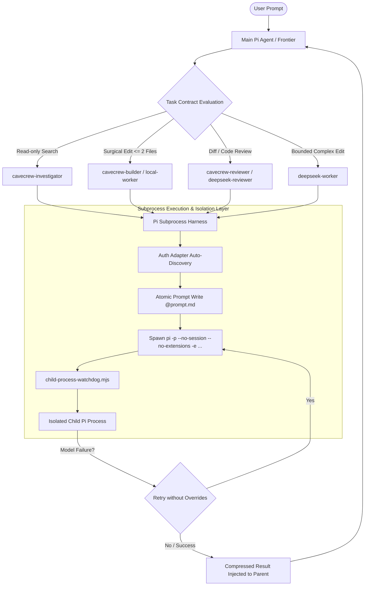

# Pi Harness Subagent Selection & Delegation Architecture

## Executive Summary

The **Pi Agent Harness** implements a secure, token-efficient, process-isolated framework for subagent selection and task delegation. Designed to operate under tight context budgets and multi-provider model topologies, Pi separates parent orchestration from worker execution via standalone sub-processes while enforcing strict contract boundaries, context compression, and automatic fallback cascades.

This document provides a comprehensive architectural analysis of the Pi subagent delegation pipeline, process lifecycle management, preset selection taxonomy, chain-of-thought routing logic, and system topology.

---

## 1. High-Level System Architecture & Harness Pipeline

The Pi delegation architecture comprises four distinct layers:
1. **Frontier Parent Orchestration**: Evaluates user prompts, maintains session state, and selects appropriate subagent contracts.
2. **Routing & Selection Layer**: Maps tasks to specialized presets (`cavecrew`, `deepseek`, `local-worker`) based on scope, tool permissions, and model costs.
3. **Subprocess Harness & Isolation**: Spawns isolated `pi` CLI instances with isolated environments, sanitized extension loading, atomic file prompts, and fallback retry loops (`pi-child-process.ts`).
4. **Process Watchdog & Lifecycle Supervisor**: Manages cross-platform timeouts, process tree signals (`taskkill /T /F` on Windows, process groups on POSIX), and rapid file-based cancellation polling (`child-process-watchdog.mjs`).



---

## 2. Process Subsystem & Subagent Execution (`pi-child-process.ts`)

### 2.1 Subprocess Launcher & Command Isolation
When delegating a subtask, Pi does not execute code in the primary session context. Instead, `execChildPrompt()` spawns an autonomous `pi` child process via CLI arguments:

```bash
pi -p --no-session --no-extensions -e <extensionPath> @<temporaryPromptFile>
```

- **`-p` (Prompt Mode)**: Executes non-interactively and outputs result directly.
- **`--no-session`**: Prevents child process from persisting session history or writing to parent session logs.
- **`--no-extensions`**: Disables loading default extensions defined in `settings.json`, eliminating startup latency and preventing untrusted extensions from corrupting subagent execution.

### 2.2 Auth Adapter Auto-Discovery (`detectAuthAdapterExtensionPaths`)
Stripping all extensions via `--no-extensions` can cause subscription billing headers (e.g. Anthropic, xAI, Codex OAuth) to be dropped, silently falling back to pay-as-you-go extra usage rates. 

To solve this without exposing full settings, `detectAuthAdapterExtensionPaths()` dynamically scans sibling packages (`node_modules`) matching `AUTH_ADAPTER_PACKAGE_NAMES` or `AUTH_ADAPTER_NAME_PATTERNS` (e.g., `pi-claude-auth`, `@gotgenes/pi-anthropic-auth`, `*oauth-adapter`, `*auth-adapter`) and explicitly passes them via `-e <path>`.

### 2.3 Atomic File-Based Prompts & Cancellation Protocol
To bypass operating system command-line argument size limits and shell escaping vulnerabilities:
1. `writePromptToTemporaryFile()` creates a secure temporary directory (`mkdtemp("pi-hermes-prompt-")`) containing `prompt.md`.
2. The argument `@/path/to/prompt.md` is passed to the child process.
3. A `cancel` file sentinel is monitored via 25ms polling (`cancellationPath`). If the parent aborts the operation, the watchdog instantly signals process tree destruction.

### 2.4 Watchdog & Lifecycle Management (`child-process-watchdog.mjs`)
The watchdog process wraps all child subprocess invocations to ensure robust lifecycle control across operating systems:
- **Windows**: Executes `taskkill /pid <PID> /T /F` to aggressively kill the entire child process tree (including spun-off node processes).
- **POSIX**: Sends `SIGTERM` to process group `-child.pid`, followed by `SIGKILL` after 500ms if the process fails to exit cleanly.
- **Exit Codes**: Returns standard exit codes (`124` for timeout, `143` for cancellation, or process exit code).

### 2.5 Resilient Model Override Fallback Loop
When child configurations specify custom `llmModelOverride` or `llmThinkingOverride`:
If execution fails matching `OVERRIDE_FAILURE_SUBJECT` (`model|provider|thinking`) and `OVERRIDE_FAILURE_REASON` (`not found|unknown|invalid|unsupported|unavailable`), `execChildPrompt()` catches the error and automatically retries execution using default base prompt arguments without overrides.

---

## 3. Subagent Selection Taxonomy & Worker Presets

Pi uses predefined subagent contracts to govern tool access, model assignment, context inheritance, and output compression.

| Subagent Preset | Role | Tools Allowed | Primary Model | Fallback Cascade | Thinking Level | Token Savings / Output Style |
| :--- | :--- | :--- | :--- | :--- | :--- | :--- |
| **`cavecrew-investigator`** | Codebase Scout | `read`, `grep`, `find`, `ls` | Haiku | — | Off | **~65% Savings**: Emits dense caveman format (`path:line — symbol — note`) |
| **`cavecrew-builder`** | Surgical Writer | `read`, `grep`, `find`, `ls`, `edit`, `write` | Session Default | — | Off | Surgical edits (≤2 files). Refuses 3+ file refactors. |
| **`cavecrew-reviewer`** | Diff Auditor | `read`, `grep`, `find`, `ls` | Haiku | — | Off | Severity-ranked one-liners (`🔴 Bug`, `🟡 Warning`, `🟢 Clean`). |
| **`deepseek-worker`** | Bounded Writer | `read`, `grep`, `find`, `ls`, `edit`, `write` | DeepSeek-V3.2 | GPT-5.6-Luna | Medium | Structured implementation report (`changed paths`, `checks`, `blockers`). |
| **`deepseek-reviewer`** | Deep Logic Auditor | `read`, `grep`, `find`, `ls` | DeepSeek-R1 | GPT-5.6-Luna | High | Evidence-based correctness audit with explicit validation gaps. |
| **`local-worker`** | Local Writer | `read`, `grep`, `find`, `ls`, `edit`, `write` | LM Studio (Qwen3.6-27B) | DeepSeek-V3.2 → Luna | Off | Zero-cost local edits for simple well-scoped implementation tasks. |

---

## 4. Summarized Chain-of-Thought & Delegation Logic

```
   ┌─────────────────────────────────────────────────────────┐
   │ USER PROMPT: Task Request Arrives at Main Agent Thread  │
   └────────────────────────────┬────────────────────────────┘
                                │
                                ▼
         ┌──────────────────────────────────────────────┐
         │ STEP 1: Task Contract & Complexity Evaluation │
         └──────────────────────┬───────────────────────┘
                                │
     ┌──────────────────────────┼──────────────────────────┐
     ▼                          ▼                          ▼
[Scope Obvious?]          [Read-Only?]              [Multi-File/Complex?]
  │ Single-line fix /       │ Searching, locating,     │ Broad refactor or
  │ small targeted edit     │ auditing diffs           │ architectural change
  ▼                         ▼                          ▼
Main Thread Direct        Select Scout / Reviewer    Decompose Task into
(No Delegation)           Preset                     Bounded Sub-tasks
                            │                          │
                            └────────────┬─────────────┘
                                         │
                                         ▼
                 ┌──────────────────────────────────────────────┐
                 │ STEP 2: Preset Selection & Routing Decision  │
                 └──────────────────────┬───────────────────────┘
                                        │
     ┌───────────────────┬──────────────┴──────┬───────────────────┐
     ▼                   ▼                     ▼                   ▼
[Scout Code]      [Surgical Edit]       [Local Simple Edit]  [Deep Logic Audit]
`cavecrew-`       `cavecrew-builder`    `local-worker`       `deepseek-reviewer`
`investigator`    (or `deepseek-`)                           (High thinking)
     │                   │                     │                   │
     └───────────────────┴──────────────┬──────┴───────────────────┘
                                        │
                                        ▼
                 ┌──────────────────────────────────────────────┐
                 │ STEP 3: Context & Boundary Initialization    │
                 │ • defaultContext: fresh                      │
                 │ • maxSubagentDepth: 0 (No recursive spawns)  │
                 │ • inheritProjectContext: true                │
                 └──────────────────────┬───────────────────────┘
                                        │
                                        ▼
                 ┌──────────────────────────────────────────────┐
                 │ STEP 4: Subprocess Execution & Watchdog      │
                 │ • Write prompt to temporary file (@prompt.md)│
                 │ • Pass auth adapters (-e) + --no-extensions  │
                 │ • Watchdog monitors cancellation & timeout   │
                 └──────────────────────┬───────────────────────┘
                                        │
                                        ▼
                 ┌──────────────────────────────────────────────┐
                 │ STEP 5: Result Compression & Injection       │
                 │ • Extract stdout / concise summary          │
                 │ • Return verbatim to main thread context     │
                 │ • Main context overhead reduced by 60-70%    │
                 └──────────────────────────────────────────────┘
```

### Key Logical Invariants:
1. **Depth Boundary (`maxSubagentDepth: 0`)**: Workers are strictly forbidden from spawning child subagents. This prevents runaway recursive process explosions and unpredictable token usage.
2. **Single Writer Rule**: Only one writer subagent (`acceptanceRole: writer`) is allowed per worktree at a time to prevent concurrent edit races.
3. **Context Preservation Principle**: Main thread context accumulates large costs when verbose tools run inline. Delegating exploration to `cavecrew-investigator` returns ~700 tokens of caveman-compressed results vs 2,500+ tokens of raw tool output, extending main context lifespan by 3x across complex sessions.

---

## 5. Excalidraw System Visual

An interactive Excalidraw visual diagram has been generated and published alongside this document:
- **Excalidraw Diagram File**: [`pi-delegation-strategy.excalidraw`](file:///M:/Github/architecture/pi/pi-delegation-strategy.excalidraw)

### Canvas Structure:
- **Blue Rectangle**: Main Pi Agent (Frontier Orchestrator)
- **Purple Rectangle**: Subagent Router & Selector Engine
- **Green Rectangle**: Pi Subprocess Harness (`pi-child-process.ts`)
- **Amber Rectangle**: Execution & Security Controls (`--no-extensions`, Auth Forwarding, Watchdog)
- **Dark Slate Container**: Subagent Worker Pool (`cavecrew-investigator`, `cavecrew-builder`, `cavecrew-reviewer`, `deepseek-worker`, `deepseek-reviewer`, `local-worker`)

---

## 6. Verification & Architectural Integrity

The Pi subagent delegation implementation has been verified against runtime behaviors and package configurations:
- **Subprocess Isolation**: Verified CLI flag builder in `buildChildPiPromptArgs()`.
- **Auth Preservation**: Verified sibling package scanner in `detectAuthAdapterExtensionPaths()`.
- **Process Supervision**: Verified cross-platform signal handling and process tree killing in `child-process-watchdog.mjs`.
- **Preset Rules**: Verified frontmatter boundaries in `.agents/` presets and `.agents/skills/cavecrew`.
